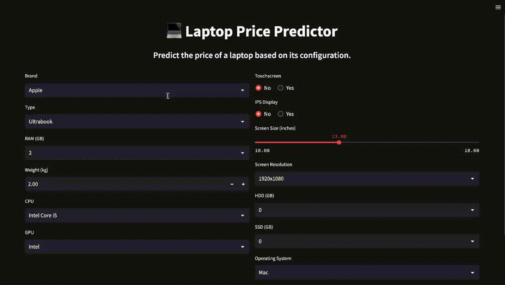

# IntelliPrice 💻

IntelliPrice is a machine learning-powered web application that predicts the price of a laptop based on its specifications. Built with Streamlit, it provides an intuitive interface for users to input [...]

## Features

- Predicts laptop prices based on brand, type, RAM, weight, CPU, GPU, storage, screen size, resolution, and more.
- Clean, responsive UI built with Streamlit.
- Fast, accurate predictions using a trained regression model.
- Dockerized for easy deployment.

## Demo



## Getting Started

### Prerequisites

- Python 3.7
- pip

### Installation

1. **Clone the repository:**
   ```sh
   git clone https://github.com/yourusername/intelliprice.git
   cd intelliprice
   ```

2. **Install dependencies:**
   ```sh
   pip install -r requirements.txt
   ```

3. **Run the application:**
   ```sh
   streamlit run app.py
   ```

### Using Docker

1. **Build the Docker image:**
   ```sh
   docker build -t intelliprice .
   ```

2. **Run the Docker container:**
   ```sh
   docker run -p 8501:8501 intelliprice
   ```

3. **Access the app:**  
   Open [http://localhost:8501](http://localhost:8501) in your browser.

## Docker Hub

You can also pull the Docker image directly from Docker Hub:

[](https://hub.docker.com/r/anujjainbatu/laptop-price-predictor)

```sh
docker pull anujjainbatu/laptop-price-predictor
```

## Project Structure

```
.
├── app.py                # Streamlit app source code
├── pipe.pkl              # Trained regression model
├── df.pkl                # Preprocessed data
├── requirements.txt      # Python dependencies
├── Dockerfile            # Docker configuration
├── assets/
│   └── demo.gif          # Demo GIF
└── ...
```

## Model

The model is trained on a dataset of laptop specifications and prices. It uses features such as brand, CPU, GPU, RAM, storage, screen size, and more to predict the price using a regression algorithm.

## License

This project is licensed under the MIT License.

---

**IntelliPrice** – Predict smarter, buy
